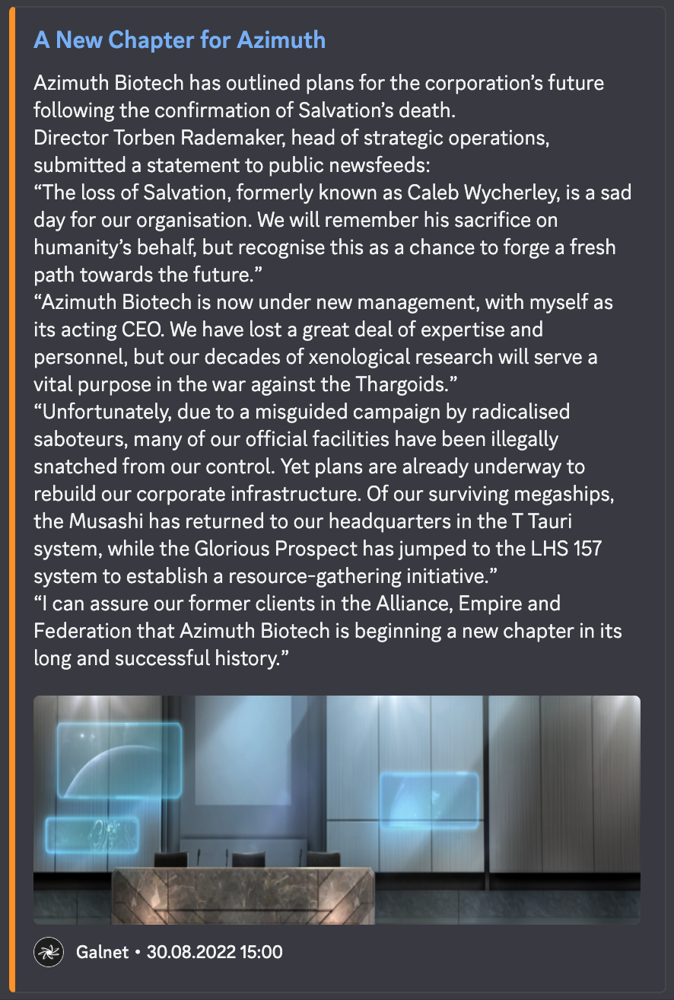

<div align="center">
  
  <h1>Elite Dangerous Reporter</h1>
</div>

<div align="center">
  <a href="https://github.com/jovanblazek/ED-Reporter/issues" target="_blank">
    
  </a>

  <a href="https://github.com/jovanblazek/ED-Reporter" target="_blank">
    
  </a>

  <a href="https://github.com/jovanblazek/ED-Reporter/blob/main/LICENSE" target="_blank">
    
  </a>
</div>

<div align="center">
  <a href="https://discord.com/oauth2/authorize?client_id=1009109668020367412" target="_blank">
    
  </a>
</div>

## 🎯 What is Reporter?

Reporter is a discord bot that sends new Galnet articles to your server. Bot currently supports
two languages: English and Czech.

1. Add Reporter to your server
2. Setup using the `/subscribe` command, and choose your preferred language and channel
3. Enjoy!
4. To stop the bot from sending messages use the `/unsubscribe` command

Example message:


Reporter can be setup just once per server.

## 📡 Commands

| Command       | Description              |
| ------------- | ------------------------ |
| `subscribe`   | Setup/update preferences |
| `unsubscribe` | Remove saved preferences |

## 💻 Environment Setup

1. Create an app with a bot on Discord developer portal
2. Copy `.env.example` file to `.env` file and fill in the values.
3. Set your development server ID and bot token in `.env` file.
4. Run `docker-compose up` to start the DB.
5. Run `npm run migrate` to create the tables.
6. Install the dependencies with `npm install`.
7. Run `npm run register-commands dev` to register the commands on your testing server.
8. Run `npm run dev` to start the bot.

## 💿 Migrations

After changing the prisma schema, create a migration using following command:

```
prisma migrate dev --name added_column
```

Whenever you make changes to your Prisma schema in the future, you manually need to invoke `prisma generate` in order to accommodate the changes in your Prisma Client API.

## 📖 Translations

Bot utilizes [DeepL API](https://www.deepl.com/pro-api) for translating the Galnet articles. To get your API key, go to [DeepL](https://www.deepl.com/pro-api) and create a developer account for free.
The translations are turned off in `development` environment to save API quota. In order to turn on the translations, you need to set `NODE_ENV=production` in `.env` file.
